<picture>
  <source media="(prefers-color-scheme: dark)" srcset="assets/hero-dark.svg">
  <source media="(prefers-color-scheme: light)" srcset="assets/hero-light.svg">
  
</picture>

---

Go, Python ve Rust ile yüksek performanslı dağıtık sistemler inşa ediyorum. Son dönemdeki işlerimin çoğu mobil güvenlik: Android ve iOS uygulamalarını tersine mühendislikle çözmek, çalışma zamanında enstrümante etmek ve aynı muameleye dayanması gereken korumaları yazmak. Altında sistem seviyesi işler var — eBPF, TUN yığınları, düşük seviyeli ağ — ve Apple platformlarında native Swift.

---

## Neler yapabiliyorum

İşin tamamını üstleniyorum: veri modeli ve doğruluğu, onu taşıyan çalışma zamanı ve insanların gerçekten dokunduğu arayüz. Aşağıdaki liste hangi müşteri için olduğunu değil, neyin bana teslim edilebileceğini anlatır.

> İşlerin bir kısmı gizlilik kapsamında; bu yüzden isimler, kapsam ve sonuçlar bilinçli olarak dışarıda bırakıldı. Burada anlatılan yetenek, yapılan işin kendisi değil.

| Yetenek | Kapsam |
|---|---|
| **Mobil uygulama güvenliği** | Tersine mühendislik ve savunma aynı masada. APK/DEX ve Mach-O analizi, Frida ile çalışma zamanı enstrümantasyonu, SSL pinning, root, emülatör ve kurcalama tespitini atlatma — ardından aynı mekanizmaları üretim koduna yazma: RASP, kendi kendini bütünlük doğrulaması, hata ayıklayıcı tespiti. Bulgular kanıt konumu, saldırı yolu ve düzeltme ile teslim edilir; spekülatif iddialar doğrulanmış olanlardan ayrı kalır. |
| **Para doğruluğu gerektiren çekirdekler** | Tek bir minor unit'in sapmasına izin verilmeyen defterler: çift kayıtlı kayıtlar, tamsayı tutarlar, idempotency anahtarları ve maker-checker onayı. Mutabakat elle yapılan bir ritüel değil, kanıt üreten zamanlanmış bir iştir. |
| **Çok kiracılı platformlar** | Sınırları çizilmiş bağlamlara ayrılmış modüler monolitler, veritabanı seviyesinde zorlanan tenant izolasyonu ve fail-closed yapılandırma. Outbox, saga, dead-letter yönetimi ve leader election, tekrar denemeler altında asenkron işi doğru tutar. |
| **Gerçek zamanlı medya ve veri hatları** | Belirlenimci zaman damgalarıyla çok kaynaklı alım, kompozisyon, kodlama ve paketleme. Medya çekirdeği, akış başına süreç başlatmak yerine fork'lanmış kütüphanelere süreç içinde bağlanır. |
| **Kimlik ve yetkilendirme** | Passkey, ikinci faktör, anahtar rotasyonu ve mühürlü kimlik bilgisi. Makine erişimi ile insan oturumu ayrı kalır; güven, iletilen bir başlıktan değil doğrudan soketten kararlaştırılır. |
| **Yapay zeka ajan sistemleri** | Araç orkestrasyonu, vektör ve grafik depolar üzerinde kalıcı hafıza ve birinci sınıf arayüz olarak MCP sunucuları içeren çok servisli ajan platformları. |
| **Apple platform uygulamaları** | iOS ve macOS üzerinde native SwiftUI: menü çubuğu araçları, izin onboarding'i, Keychain destekli sırlar, konuşma ve ses yakalama ve incelemeden geçen dağıtım. |
| **Düşük seviyeli sistem ve ağ** | eBPF, TUN yığınları ve raw socket ile çekirdek ve ağ seviyesinde mühendislik. |
| **Tarayıcı otomasyonu ve kanıtlı araçlar** | Gerçek yapıyı çıkaran, onu belirlenimci biçimde yeniden kuran ve başarı iddia etmek yerine sonucu pixel diff ile kanıtlayan başsız otomasyon. |

## Açık kaynak

| Proje | Ne yapar | |
|---|---|---|
| **[ctx-agent](https://github.com/Ahmetshbzz/ctx-agent)** | Universal Agent Context Protocol. AI ajanlarının kod tabanını çalıştırmadan anlamasını sağlar; tek binary, SQLite, offline. LLM yok, bulut yok. | `Rust` ★10 |
| **[anthropic-turkce-courses](https://github.com/Ahmetshbzz/anthropic-turkce-courses)** | Anthropic'in resmi eğitim materyallerinin Türkçe çevirisi. | `Jupyter` ★19 |
| **[voicman](https://github.com/Ahmetshbzz/voicman)** | macOS menü çubuğu dikte uygulaması. Global kısayol, Apple Speech ile canlı transkripsiyon, aktif uygulamaya yapıştırma. | `Swift` |
| **[DockNest](https://github.com/Ahmetshbzz/DockNest)** | macOS Dock launcher'ı. Kurulu geliştirici araçlarını metadata'dan keşfeder, sürükle-bırak ile açar. Telemetri yok, ağ erişimi yok. | `Swift` |
| **[json](https://github.com/Ahmetshbzz/json)** | Tarayıcı eklentisi: JSON verisini okunaklı biçimde görüntüler. Açık/koyu tema, API performans metrikleri, dışa aktarma. | `JavaScript` |
| **[apple-docs-mcp](https://github.com/Ahmetshbzz/apple-docs-mcp)** | Xcode'un yerel indeksi üzerinden çevrimdışı Apple Developer dokümantasyon araması için MCP sunucusu ve CLI. | `Python` |

## Kapalı kaynak ve özel işler

Yaptığım işlerin çoğu private repo'larda, yani tıklanacak bir şey yok. Bu onları daha az gerçek yapmıyor; işin büyük kısmı ve ilginç tarafları orada.

| Alan | Nedir |
|---|---|
| **Mobil güvenlik araçları** | Tersine mühendislik ve enstrümantasyon referanslarının sürümlenen kataloğu — mobil RE iş akışı, Frida hooking kalıpları, SSL pinning bypass, root ve jailbreak bypass — birincil kaynaklar ve eval setleriyle; okunmak için değil çalıştırılmak için yazıldı. |
| **Çalışma zamanı koruması** | Üretim servislerinde ortam, süreç ve zamanlama vektörlerinde hata ayıklayıcı ve bütünlük kontrolleri; tek seferlik bir kapı yerine self-hash doğrulaması ve periyodik yeniden kontrol. Ayrıca web için inceleme önleyici araçlar — debugger tuzakları, inceleme kısayolu kontrolü, yaşam döngüsüne duyarlı zamanlayıcılar — MIT lisanslı `disable-devtool`'dan türetildi ve sınırı ima edilmek yerine yazıldı. |
| **Ajan altyapısı** | Çok sağlayıcılı arama ve içerik çıkarma MCP sunucusu: 13 arama sağlayıcısı, sayfa çıkarma, başsız render, derin araştırma ve site keşfi. Sağlayıcı kümeleri arasında model bazlı yönlendirme yapan bir Anthropic Messages API ters proxy'si. |
| **Canlı medya platformu** | Yayın alımı ve yeniden dağıtımı: çok kaynaklı alım, transcode, çalışma zamanında değişebilen grafik kompozisyonu, HLS/DASH yeniden yayını. Rust çekirdek, belirlenimci hat. |
| **Yapay zeka arkadaş platformu** | Kalıcı hafıza, web tarama, MCP araçları, gerçek zamanlı ses, native iOS istemcisi ve çok servisli backend. |
| **Oyun platformu** | Go RGS çekirdekli modüler monolit, oyun istemcisi ile sunucu arasında tipli sözleşmeler, stüdyo araçları ve bulguları dosyalanmak yerine kapanışa kadar izlenen bir güvenlik inceleme döngüsü. |
| **Bankacılık sektörü entegrasyonları** | Go ile Polonya ve AB finansal entegrasyonları: fatura ve takas şemaları, taşıyıcıdan bağımsız gönderi ağ geçidi, çok kiracılı SaaS. Yoğun doğrulama, sürümlenen şemalar ve idempotent olmayan hiçbir retry yok. |

## Teknoloji

**Güvenlik & tersine mühendislik**

**Backend**

**Frontend & mobil**

**Altyapı & veritabanı**

## Katkı grafiği

<picture>
  <source media="(prefers-color-scheme: dark)" srcset="https://raw.githubusercontent.com/Ahmetshbzz/Ahmetshbzz/output/snake-dark.svg">
  <source media="(prefers-color-scheme: light)" srcset="https://raw.githubusercontent.com/Ahmetshbzz/Ahmetshbzz/output/snake-light.svg">
  
</picture>

---

## İletişim

